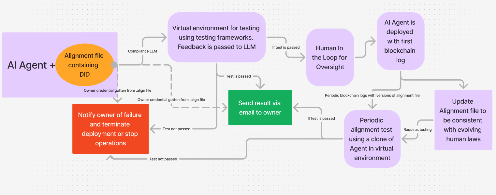

# Alignment Compliance Framework for AI Agents in a Super Intelligent Future

In a post-AGI future, misaligned AI systems risk harmful consequences, especially with control over critical infrastructure. The Alignment Compliance Framework (ACF) ensures ethical AI adherence using .align files, Alignment Testing, and Decentralized Identifiers (DIDs). This scalable, decentralized system integrates alignment into development and lifecycle monitoring. ACF offers secure libraries, no-code tools for AI creation, regulatory compliance, continuous monitoring, and advisory services, promoting safer, commercially viable AI deployment.

This repository contains details of AI Alignment Framework first developed at the Apart Safety and Entrepreneurship Hackathon organised by Apart Research. FInd the initailly published work here: https://www.apartresearch.com/project/align-file

## How To Use

1. Get the following API keys:
    - Infura keys from Infura now part of Metamask
    - Pinata keys for uploading alignment and DID file to IPFS
2. Use an encryption script to encrypt your keys (main key and secret key) for infura and pinata. Four keys in total. Store the encrypted keys in a dot env file.
3. The encryption script outputs the encryption keys into two files. These encryption keys uses AES 256 (16 bytes) for secret key and the initialization vector (IV) uses 16 bytes for CBC mode
4. use npm to run dependencies

## Current Architecture

## How it Works

1. AI agent is responds to emails using GPT-4 model to learn of an appropriate response given information prior about myself. The appropriate response is kept aligned to my values via the alignment file which defines the purpose and scope of the AI agent

2. If alignment file is updated, the AI agent is tested for compliance using the alignment values and scope to determine compliance. 

3. A combined file called did_alignfile.txt containing the DID metadata and alignment file is uploaded to IPFS. The CID returned from IPFS is appended to the DID metadata file and alignment file. A new did_alignfile.txt is created containing the most recent information. 

For more clarification, contact Fabari Agbora on LinkedIn or Twitter. 
